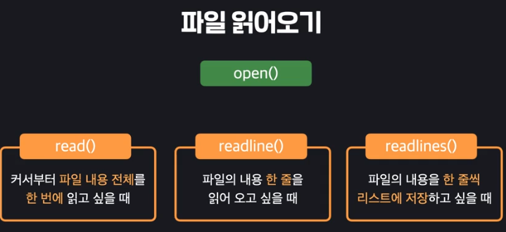

### 1. 1~52주차 폴더만들기
```python
import os

for i in range(1,52):

    os.mkdir("{}주차 보고서 폴더".format(i))
```


### 2. 파일 정보 보기

```python
# 파일 용량보기

import os

size = os.path.getsize("cat.jpeg")
print(size)

def byte_to_kb(byte):
    kb = byte / 1000
    return kb

print("{}kB".format(byte_to_kb(size)))
```

```python
# 파일 정보보기

import os
import datetime

def timestamp_to_time(timestamp):
    return datetime.datetime.fromtimestamp(timestamp)

creattime = os.path.getctime("cat.jpeg")
modifytime = os.path.getmtime("cat.jpeg")
accesstime = os.path.getatime("cat.jpeg")

print(
    "만든날짜 Time Stamp(1980년 1월 1일부터 지난 시각을 초로 환산한 것): {}"
    .format(creattime))

print(
    "만든날짜 표준단위로 변환한 시간: {}".format(timestamp_to_time(creattime))
    + "\n"
    + "수정날짜 표준단위로 변환한 시간: {}".format(timestamp_to_time(modifytime))
    + "\n"
    + "액세스한 날짜 표준단위로 변환한 시간: {}".format(timestamp_to_time(accesstime)))

```

### 3. 파일 읽기



```python
file = open("my_favorite_song.txt", encoding="utf-8")

# 1번째 줄 읽기
print(file.readline())
# 2번째 줄 읽기
print(file.readline())
# 3번째 줄부터 끝까지 읽기
print(file.read())

# 커서 처음으로 가져와서 1째줄부터 끝까지 읽기
file.seek(0)
print("\n커서 처음으로 가져와서 1째줄부터 끝까지 읽기\n")
print(file.read())

# 파일 내용 한줄 씩 리스트에 담기
print("\n파일 내용 한줄씩 리스트에 담아서 출력\n")
file.seek(0)
print(file.readlines())

# 파일 내용 한줄 씩 끊어서 출력하기
print("\n파일 내용 한줄 씩 끊어서 출력하기\n")
file.seek(0)
for line in file:
    print(line)
```

### 4. 파일 닫기

파일 닫기 (닫지 않으면 다른 프로그램들이 해당 파일에 접근할 수 없음)

```python
file = open("my_favorite_song.txt", encoding="utf-8")

for line in file:
    print(line)

file.close()
```

매번 close가 번거롭기 때문에 이렇게 *with 구문(열고 닫는 행위 자동화)*을 사용한다.

```python
with open("my_favorite_song.txt", encoding="utf-8") as file:
    for line in file:
        print(line)
```

### 5. 파일 수정하기


```python
# with문으로 file read
with open('file_path', 'r') as file: #'r'은 생략 가능
    content = file.read()

# with문으로 file write, append
with open('file_path', 'w') as file: # 'w'는 수정기능 'a'는 추가기능
        print('file created.')
        file.write('text') # 필요하다면 파일 쓰기를 할 수 있습니다.
# 파일 이름 변경
import os

os.rename('변경 대상 파일', '바꾸고 싶은 이름')

## 파일 삭제
os.remove('codeit_report.txt')
```

#### 파일 읽기와 쓰기 실습
파일 목록을 보면 codeit.txt 라는 파일이 있습니다. 이 파일을 열고, 파일의 내용을 아래와 같이 수정한 뒤 모든 내용을 출력해 보세요. 추가할 문자열은 템플릿에 있습니다.

변경전 codeit.txt 파일
```
안녕하세요. codeit 업무자동화 강의에 오신 것을 환영합니다.
업무 효율은 일을 얼마나 빨리 하는지에 달려 있다고요? 
아닙니다. 일을 얼마나 자동화하느냐에 달려 있습니다. 
업무 자동화가 가진 파급력, 직접 경험해 보세요.
```

변경후 codeit.txt 파일
```
안녕하세요. codeit 업무자동화 강의에 오신 것을 환영합니다.
업무 효율은 일을 얼마나 빨리 하는지에 달려 있다고요? 
아닙니다. 일을 얼마나 자동화하느냐에 달려 있습니다. 
업무 자동화가 가진 파급력, 직접 경험해 보세요.
업무 자동화는 실제 어떤 업무에 적용하고 사용할 지에 대해서 잘 아는게 중요하기 때문에
개발 지식보다는 업무에 대한 이해가 높은 사람들이 오히려 더 잘 할 수 있습니다.
```

코드
```python
str_1 = "업무 자동화는 실제 어떤 업무에 적용하고 사용할 지에 대해서 잘 아는게 중요하기 때문에\n"
str_2 = "개발 지식보다는 업무에 대한 이해가 높은 사람들이 오히려 더 잘 할 수 있습니다."

with open('codeit.txt', 'a+', encoding='utf-8') as codeit_txt:
    codeit_txt.write(str_1)
    codeit_txt.write(str_2)
    codeit_txt.seek(0)
    print(codeit_txt.read())
```


### 6. 파일 복제하기

```python
# 기본형
with open("codeit_1.txt") as file:
    content = file.read()

with open("codeit_2.txt", "w+") as file:
    file.write(content)

# shutil 모듈 사용
import shutil

shutil.copy('codeit_1.txt', 'codeit_3.txt')
```

### 7. 파일 삭제하기

```python
import os

os.remove('codeit_report.txt')
```

### 8. 파일 압축 (zipfile 모듈 사용)

```python
# 압축 

import zipfile

with zipfile.ZipFile("favorite.zip", "w", compression=zipfile.ZIP_DEFLATED) as zip: # compression 옵션을 넣어줘야 용량을 줄이면서 압축할 수 있음에 주의
    zip.write("내가 좋아하는 노래.txt")
    zip.write("하품하는 고양이.jpeg")

# 압축풀기
import zipfile

with zipfile.ZipFile("favorite.zip", "r") as zip:
    zip.extractall("data") # data 폴더에 저장
```